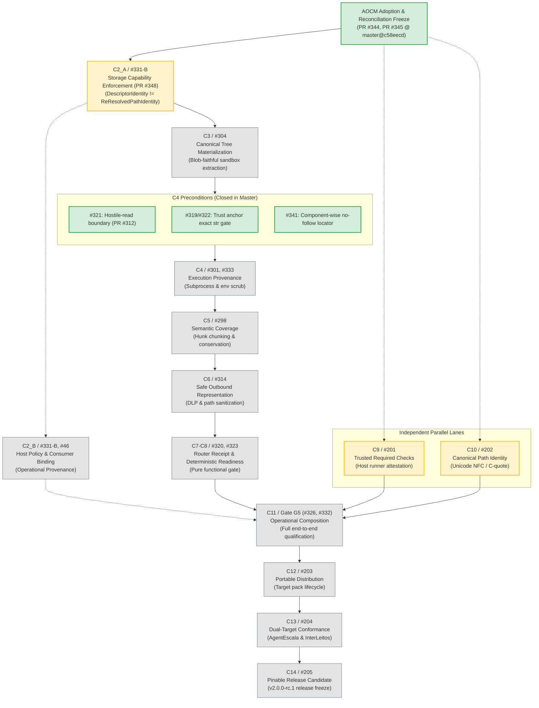

# NON_NORMATIVE_RECONCILIATION_ARTIFACT
# Status: PROPOSED_AOCM_REPLAN
# AgentReview v2 — Dependency Directed Acyclic Graph (DAG)

**Repository:** `mglpsw/aiops-orchestrator`  
**Method:** AOCM-MPACK 0.1.0-preview.1  
**Campaign:** `agent-review-v2-replan`  
**Date:** 2026-09-23  
**Roadmap Authority:** [Issue #46](https://github.com/mglpsw/aiops-orchestrator/issues/46)  

---

## 1. Visual Dependency Graph



---

## 2. Critical Path Sequence and Execution Rules

The primary critical path consists of strictly dependent transformations:

```text
Knowledge / Claim Freeze (PR #344, PR #345)
  ↓
C2_A: Storage Capability Enforcement (#331-B, PR #348)  <-- IMPLEMENTED, PENDING EXACT-HEAD REVIEW
  ↓
C3: Canonical Tree Materialization (#304)
  ↓
C4: Execution Provenance (#301, #333)
  ↓
C5: Semantic Coverage & Manifest (#298)
  ↓
C6: Safe Outbound Representation / DLP (#314)
  ↓
C7-C8: Router Receipt Binding & Deterministic Readiness (#320, #323)
  ↓
C11: Gate G5 Operational Composition (#326, #332)
  ↓
C12: Portable Distribution (#203)
  ↓
C13: Dual-Target Conformance (#204)
  ↓
C14: Pinable Release Candidate (#205)
```

### Execution Rules:
1. **WIP = 1 on Critical Chain**: Work on the critical chain proceeds strictly one obligation at a time. PRs for successor obligations may not be opened until the predecessor's draft is approved and integrated.
2. **Independent Lanes Policy**:
   - `C9 / #201` (Trusted Required Checks) and `C10 / #202` (Canonical Path Identity) are structurally orthogonal to the internal hunk-chunking / DLP modules.
   - They may advance as separate branches if and only if their write sets do not touch `app/agent_review/trusted_object_authority_v2.py` or `diff_authority_v2.py`.
   - Both must converge and be merged before Gate G5 (`C11`) qualification.
3. **No Retroactive Weakening**: Successor obligations must never silently drop or relax preconditions established by predecessors.
